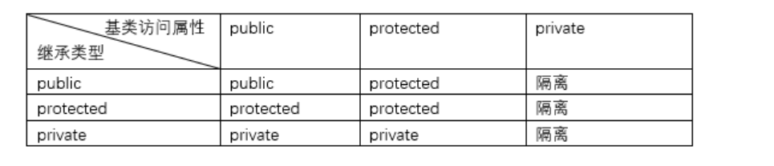
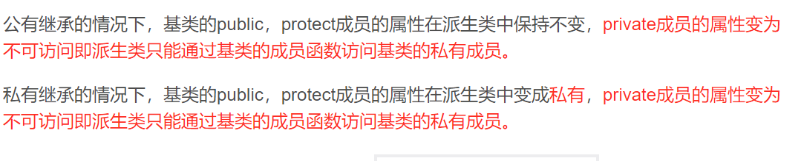
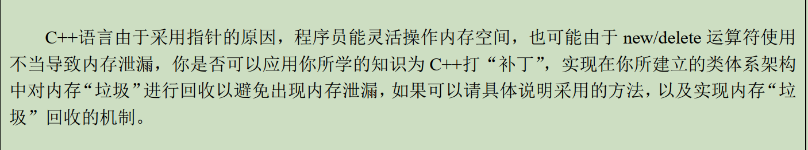
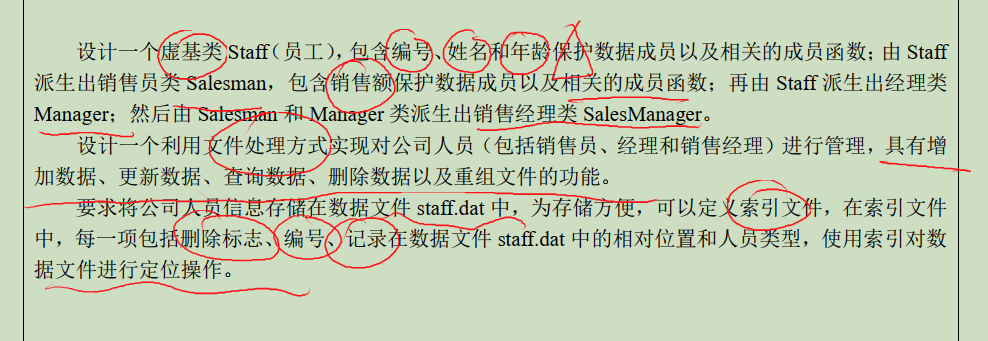

## 声明

1. 本仓库旨在快速复习C++的理论知识以应对期末考试，仓库内容具有不全面、基础、零散的特点，勿喷。
2. 不排除出现我认为较为基础所以没写上，但是读者却暂未掌握的知识点。
3. 读者如果发现任何事实性以及理解性错误都可以在issue中提出，本人会及时修改。
4. 参考资料：[《C++ Primer 第五版》](https://www.amazon.com/Primer-5th-Stanley-B-Lippman/dp/0321714113) [《CPlusPlusThings》](https://github.com/Light-City/CPlusPlusThings)

## 练手demo

> 因为时间关系，我实现的版本都比较粗糙，大家可以自行改进自己的版本。比如模拟堆栈那块，大家可以自行模拟一下队列，或者内部不维护数组，维护一个容器之类的、以及设计一个check函数等等。

[文件读写：简单职工管理](./demo/employee.cpp)

[C++Primer的Demo：文本查询程序](./demo/text_query/)

[智能指针实现简单的容器](./demo/shared_ptr_test.cpp)      [头文件](./demo/shared_ptr_test.h)

[模板模拟堆栈](./demo/demo_stack.cpp)


## OOP篇

### 权限那些事





练习：判断下列说法的正确性。
- public继承时，基类的private成员在派生类中仍旧是private。（❌）

### 何为联编？

名字很高大上，其实就是绑定。
**联编就是将模块或者函数 合并在一起生成可执行代码的处理过程（也可以叫做绑定）**，同时对每个模块或者函数调用分配内存地址，并且对外部访问也分配正确的内存地址，它是计算机程序彼此关联的过程。
**按照联编所进行的阶段不同**，可分为两种不同的联编方法：`静态联编`和`动态联编`。

练习：填空题。
- C++的有几种联编？（两种）

### 多态那些事：编译时多态 ？ 运行时多态？

- 动态多态，也叫运行时多态。使用虚函数实现。
- 静态多态，也叫编译器多态，在泛型编程中，多态基于**模板的具现化**和**函数重载解析**。

#### 运行时多态

概念而言，多态来自于继承，定义一个父类，父类的虚函数可以理解为接口方法，通过子类重写该接口方法实现具体的功能。

实现而言，就是所谓`父类引用指向子类对象`。即通过指针调用这个接口方法，然后在运行期间确定指针所指向的对象的具体类型。

还有一个使用案例是，将`多个派生类`放入`父类类型的集合中`。

优点：符合人类认识；能处理分类问题。缺点：虚函数开销大，运行时确定，无法进行优化。

#### 编译器多态

概念而言，就是`以不同的模板参数具限化导致调用不同的函数。`这样来说，并不要求这些类具有继承关系，但要求的是他们都有`相同的接口方法`。

从时间来看，在没有编译的时候编译器是无法推断出来的，在编译期间才可以推断出来。

`重载函数也是在编译时期完成，本质上就是两个不同的函数，不构成运行时多态。`

下面是例子：
```cpp
class Animal{
public:
	void cry() { cout << "Animal cry" << endl;}
}
class Dog{
public:
	void cry() { cout << "Dog cry" << endl;}
}
class Cat{
public:
	void cry() { cout << "Cat cry" << endl;}
}
template <typename T>
void animalShout(T &t){
	t.shout();
}
```

- 优点：提高运行时效率；解耦合。
- 缺点：可读性降低；无法处理分类问题；工程量大的时候编译慢。

练习：写出下面程序的执行结果。

```cpp
#include <iostream>
using namespace std;
class A{
public:
    virtual void Show()const{ cout << "this is A show " << endl;}
};
class B : public A{

};
class C : public B{
public:
    void Show() const { cout << " this is C's const show" << endl;}
    void Show() { cout << " this is C's normal show" << endl;}
};
int main(){
    A a;
    A *p = &a;
    p->Show(); // a show

    C c;
    p = &c;
    p->Show(); // 【易错】，答案：c const show
    c.Show(); // c normal show

    ((const C)c).Show(); // c const show
    return 0;
}
```

- 易错解释：对于题中的`p->Show();`，由于使用的是`父类指针`，A这个父类中`没有非const方法`，因此只会调用C的重载const方法！

### 多继承那些事：虚继承和虚基类？

- Q：什么是虚继承？
- A：虚继承是`为了解决多继承中成员变量的重复和命名冲突问题`。典型的多继承如`菱形继承`，在菱形继承中，“grandfather”的变量的两个"father"继承，这样的话，就会被"grandson"继承了两次，从而出现`调用的时候的命名冲突`。这个时候就需要中间两个类以`虚继承`的关系继承父类，这样就只会保证只继承一份数据。

语法：
```cpp
class A{};
class B: virtual public A{

};
class C: virtual public A{

};
class D: public B , public C{

};
```

- Q：什么是虚基类？
- A：此时，这个成员被两个“father”共享的"grandfather"类，就称之为`虚基类`。

> 但其实，如果B和C中都有跟A的同名属性，还是会发生命名问题。因此不推荐多继承。在这点上Java是明智的。

练习：辨析概念。
- 虚基类不等于抽象基类。拥有纯虚函数的叫做`抽象基类；或者直接说抽象类`。
- 而虚基类是`针对多继承的情况。`

### 多态那些事——虚函数

1. 静态函数、构造函数`不可以`是虚函数。
2. `析构函数`可以是虚函数，而且常常这么做。**如果我们需要删除一个指向派生类的基类指针时，应该把析构函数声明为虚函数。 事实上，只要一个类有可能会被其它类所继承， 就应该声明虚析构函数(哪怕该析构函数不执行任何操作)。**
3. 某个函数被声明为虚函数，其派生类相同函数原型的函数`都是`虚函数。

### 内联函数那些事

- `隐式内联`：类中定义了的函数是隐式内联函数。类内声明，类外出现的函数要想成为内联函数，必须在`实现处`(定义处)`加inline关键字`。
- inline要与函数实现放在一起，inline是一种`用于实现`的关键字,而不是用于声明的关键字。如`inline void A::f1(int x){}`
- 编译器对 inline 函数的处理步骤
	- 将 inline 函数体`复制`到 inline 函数调用点处；
	- 为所用 inline 函数中的局部变量`分配内存空间`.
	- 将 inline 函数的的输入参数和返回值映射到调用方法的局部变量空间中；
	- 如果 inline 函数有多个返回点，将其转变为 inline 函数代码块末尾的分支（使用 GOTO）。
- 内联能`提高函数效率`，但并不是所有的函数都定义成内联函数！内联是以`代码膨胀`(复制)为代价，仅仅省去了函数调用的开销，从而提高函数的执行效率。
- 内联是编译时候确定，所以`虚函数用于多态的时候不能内联`。没有用于多态的虚函数可以内联。

## const篇

###  const与类内函数：常成员函数

- const可以`实现对重载的区分`，`常成员函数只能调用类中的常成员函数.`

易错练习：写出下面程序输出结果。

```cpp
#include <iostream>
using namespace std;
class A{
public:
    virtual void show()const { cout << "a " << endl;}
    void show(){ cout << " b " << endl;}
};
void Refer(const A&a){
    a.show();
}
int main(){
    A a; 
    Refer(a); //易错，应该是 输出a。
    return 0;
}
```
- 易错解释：由于Refer接收的是const，因此调用的是常成员函数！考试的时候容易忽略这一带年。如果在这里将常成员函数注释，将无法通过编译。

### const与类对象——常对象

- 定义常对象的语法：`const MyClass obj;`
- 不能通过常对象调用普通成员函数，`只能调用常成员函数`。

- 练习：判断正误。
- 常对象可以调用任何不改变对象值的成员函数。(❌)通过常对象只能调用类的常成员函数。

### const与#define的区别

- const有数据类型，编译器可以进行安全检查。
- define没有数据类型，编译器无法检查。

练习：下面代码是否正确。
- `const int i;`（❌）必须初始化！
- `const int *i;` （✔）const修饰int，不修饰 * ，因此指针可以不初始化。

### const与指针

- 辨析：指向常量的指针和指针常量。方法：从右往左读。
```cpp
const char * a; // 指向常量的指针。
char const * a; // 同上
char * const a; // const指针、常指针，指针不可改变指向的地址
const char * const a; // 指向const对象的const指针。
```

#### 指向常量的指针

- 不允许通过指针修改所指向的变量的值。
- 可以把非const对象赋值给这个指针，即指针指向改了。


#### 常指针

- const指针必须进行初始化，且const指针指向的值能修改，但指向不能修改。

### const与函数

#### 修饰返回值

- const int f() 没意义
- const int * f() 返回指向const的指针
- int * const f() 返回指向不能改的指针

#### 修饰参数

- 引用+const，增加效率以及防止修改。
- `const char * src`：指向常量的指针，不会修改其值。
- 无意义：
	- `const int var`，值传递，没啥意义。


## operator篇

### 类型转换函数

- Q：什么是类型转换函数。
- A：用于将`类类型转换为基本数据类型`的函数。类似于Java的包装类，我们想实现两个Integer类的直接相加的话，类型转换函数能够满足这个需求。

- 语法：`operator type()const {return data}`
- 例如：`operator int()const{ return data;}`
- 特点：`没有参数`列表，`没有返回值`类型。

例子：
```cpp
#include <iostream>
using namespace std;
class Integer{
private:
    int n;
public:
    Integer(int n) : n(n){}
    //类型转换函数
    operator int() const{
        return n;
    }
};
int main(){
    Integer a(10);
    Integer b(20);
    //相当于：int a = Integer::operator int(10);
    cout << a + b << endl;

    return 0;
}
```

### 运算符重载只能改变运算符什么？

- 操作数类型？可以。
- 操作数个数：不能改变。
- 结合性：不能改变。
- 优先级：不能改变。

### 运算符重载注意事项

- 当一个重载的运算符是成员函数时，`this绑定到左侧运算对象`。成员运算符函数的（显式）参数数量比运算对象的数量`少一个`。
- 通常情况下，不应该重载逗号、取地址、逻辑与和逻辑或运算符。
- 当我们把运算符定义成`成员函数`时，它的`左侧运算对象必须是运算符所属类的一个对象`

### 运算符重载详解

- 重载`<<`运算符：
	- 格式`ostream& operator<<(ostream &os , const 类 &){}`
	- 尽量少在内部格式化，给用户和提供操作空间。
	- 必须是`非成员函数`！一般声明为friend。
- 重载`>>`运算符：
	- 格式：`istream& operator>>(istream &is , 非const类 &){}`
	- 输入运算符必须处理输入失败的可能情况，即必须加上`if(is)`进行判断，如果失败需要对对象进行处理，可以初始化为空等。
- 重载`==`运算符：
	- 相当于java中的重写equal方法。
	- 定义后方便标准库容器和标准库算法。
	- 相等运算符和不相等运算符应该把`工作委托给其中一个`即可。
- 重载`<`运算符：
	- 相当于Java中的compareTo方法
	- 对一些关联容器和算法有用。
- 重载`=`赋值运算符：
	- 形如：`StrVec &StrVec::operator=(initializer_list<string> il)`
	- `必须定义为成员函数。`
- 重载`[]`运算符：
	- 必须定义为`成员函数`。
	- `最好定义常量版本`和非常量版本，当作用于常量对象，返回一个常量引用防止赋值。
- 重载`++ --`运算符：
	- 建议设定为成员函数，因为改变的是所操作对象的状态。
	- 分为前置版本和后置版本。由于前置后置符号相同，那么重载的名字也是相同的，这个时候只能用一个`占位形参`来进行区分。
	- 前置版本：返回递增后对象的`引用` `StrBlobPtr& StrBlobPtr::operator++(){ ... return *this;}`
	- 后置版本：接收一个额外的不被使用的`int`形参作为区分。编译器会为其提供一个0的实参。`StrBlobPtr StrBlob::opertor++(int)`
		- 后置版本应该保存递增之前的状态，用来返回。`StrBlob ret = *this;`
	- 设计思想：同样地，后置表达式的实现可以基于已经重写好的前置表达式。
- 重载`-> 和 *` 运算符：
	- 前者必须是`类的成员`，后者通常也这么设计。

### 重载函数调用运算符

重载`()`运算符内涵比较丰富，所以单独放出来讲。

重载函数调用运算符让我们能够像使用函数一样使用类的对象。某个类定义了调用运算符，称这个类为`函数对象`。值得一提的是，`Lambda表达式本质上就是个函数对象`。函数对象可以接收参数。

有什么用呢？实际上，函数对象常常`作为泛型算法的形参`，典型的如for_each算法，就可以传入一个自己的print临时对象。

> 刚开始学习C++的时候，我对函数对象的设计也一脸懵逼，心想为什么专门弄一个函数对象出来，直接调用函数不就好了。后来学习了Java以及Java的函数式编程，发现这块对应着Java中的函数式接口以及匿名内部类。而Lambda表达式本质上也是个匿名内部类，两者可以互相转换。回过头来才理解了C++的设计。由此感叹，CS的学习正需要，“众里寻他千百度，蓦然回首，那人却在灯火阑珊处“的精神。

注意：
- 必须是`成员函数`。
- Lambda表达式实际上会被编译器翻译为未命名对象。

标准库定义的函数对象在`Functional`头文件中。

## 模板那些事

### 函数模板？模板函数？

- 使用函数模板的方法是`先说明函数模板`，然后实例化成相应的`模板函数`，进行调用执行。函数模板只是说明，不能执行，需要实例化成模板函数才能执行。
- 模板函数：C++将根据实参表中的数据类型生成一个相对应的`重载函数`。

> 模板这块我因为时间问题也没怎么看，好在final主要集中在编程题考察，细节考察的不多。

## 文件那些事

- `ios::out`：若文件存在，清除文件；如果文件不存在就`新建一个文件`

> 文件这块主要靠多写写，其实没什么好考选择和填空的。至于随机访问那块在C++ Primer里有讲，感兴趣的可以去看看，由于考试不涉及，这里也没有相关内容。

## 综合思考题

### 动态内存：设计C++的内存回收机制



我的回答供参考：

我们可以在我们设计的类内部，将所有需要开辟堆区内存的成员属性使用智能指针`shared_ptr`进行维护。智能指针会根据所指向对象的`引用计数`完成对象进行释放操作，当某个智能指针的引用计数为0，智能指针为自动释放其所指向的内存，从而无需程序员手动`delete`，可以避免在大型程序中出现内存泄露的问题。当某块内存被指针或者外部内存引用的时候，计数器++，当某个代码段结束后（例如局部的智能指针离开其作用域后）智能指针会被销毁，这个时候计数器会自动递减。一旦计数器变为0，他会自动释放自己所管理的对象。垃圾回收过程不需要打断进程运行，简单快捷。


### 实现数据库：利用STL算法和文件操作实现数据库



> 我还没实现过，感兴趣的小伙伴可以敲一个练练手。


## 小细节

- 继承中，如果写成了`class B : A{}`，即忽略了继承方式，那么默认是`private`
- 初始化静态成员，不能忽略前面的变量类型。`int A::count = 0;`，这里`int`容易遗漏。不知道为啥，我总是写成`staic A::count = 0;`。
- C++中流类库的抽象基类：`ios`，不是`stream`。所以当然不能用ios直接定义对象
- cin是`对象名`而不是类名
	- 标准库的源码：`extern istream cin;`
- 什么是`缺省参数？`——其实就是`默认值`。所谓缺省参数就是在声明函数的某个参数的时候为之指定一个默认值，在调用该函数的时候如果采用该默认值，你就无须指定该参数。
- 让你设计类的题目：
	- 注意格式问题，比如复数这玩意要判断一下再打印 `+`或者`-`。
- （无语）这句话显然错误：`**基类成员的访问能力在派生类中维持不变**`
- 对虚基类的定义`不需要`使用虚函数。
- 为了取代C++带参数的宏，C++使用了`内置函数。
- （无语）在OOP中，`类`描述的是具有相同属性与操作的一组对象。
- cout输出double类型一般不会输出末尾的`.0`，可以自己试试。
- 使用模板时候是先说明`函数模板`，然后实例化成`模板函数`。
- 在派生类的构造函数的成员列表初始化中，不能包含`父类的子对象的初始化`，否则称为越级初始化。
- 关于内联函数，就是为了解决调用的时候发生`控制转移`的问题，因此内置函数在调用的时候`不会`发生控制转移。而是将函数嵌入。
- `转换构造函数`：将`基本类型转换为类类型`。要求`形参只能有一个参数`。


## 2023年试题我没复习到的点

不自信的地方：
- 常数据成员必须初始化，并且不能被更新。
- throw后面的语句不会被执行，这点和Java一样。（当时没复习到，就不自信了。不过因为写过一些Java代码，还是相信了感觉。）
- 编译错误不属于异常，不可以抛出！硬件故障可以当作异常抛出。（硬件这个，我也不知道为啥......搜不到）
- C++引用必须初始化，也就是`int &p;`这样是错误的。在C++Primer中看过，但是当时我也不自信，为啥呢，因为后面有一个`float a; float p=a;`，我心想你这没初始化赋值啥呀。就硬是编一个你永远都不会写出来的代码让你辨析，很是无语。
- `int *&p`表示一个指针的引用。
- 

选错的地方：
- C++构造函数调用顺序：（我选错了）
	- 基类构造函数。按照某类在派生表中的顺序，而不是初始化列表中的顺序。
	- 类内有成员类，成员类构造先调用。按照被声明的顺序而不是出现在初始化列表的顺序。
	- 然后才是派生类的构造函数。
- 将类的一个对象赋值给该类的另一个对象时，不会调用拷贝构造。注意**构造**两个字。

> 这也不奇怪了，当时《C++ Primer》第十三章《构造、拷贝、控制》刚好懒得看，结果错的都是这块内容hh，这也说明复习要全面呀。